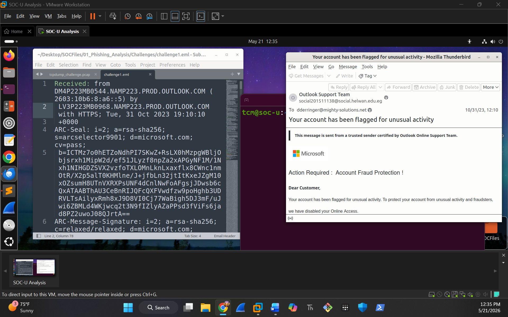

# Incident Report: Phishing Analysis Challenge 1

Challenge File:
01_Phishing_Analysis/Challenges/challenge1-phishin-emails.eml

## 📋 Artifact Discovery & Headers

* **Date:** [Tue, 31 Oct 2023 10:10:04 -0900]
* **Subject:** [Your account has been flagged for unusual activity]
* **To:** [dderringer@mighty-solutions.net]
* **From:**[Outlook Support Team]
* **Reply-To:** [social201511138@social.helwan.edu.eg]
* **Return-Path:** [social201511138@social.helwan.edu.eg]
* **Sender IP:** [40.107.22.60]
* **Resolved Host:** [mail-am6eur05on2060.outbound.protection.outlook.com]  
* **Message-ID:** [JMrByPl2c3HBo8SctKnJ5C5Gp64sPSSWk76p4sjQ@s6]

---

## 🔍 Technical Artifact Analysis

### 1. Sender & Header Analysis
* *[Document whether the Display Name matches the actual sending email address. Check if SPF, DKIM, or DMARC passed or failed based on the email headers.]*

After doing some analysis on the headers I came up with information displaying the name as “Outlook Support Team”. As well the sending email address as being “social201511138@social.helwan.edu.eg” . My analysis or interpretation as a SOC analyst: evidence of the display name show brand impersonation as the domain is not actually Microsoft showing spoofing indication. The question then becomes is the domain legitimately related to Microsoft. Upon further analysis using SPF, DKIM, DMARC it’s a university domain not a Microsoft domain. We now have a brand impersonation and an unrelated sender domain. 
Interpreting this via SPF/DKIM/DMAR further informs us as SPF pass of social.helwan.edu.eg indicates the sending IP is authorized to send on behalf of the domain but does not confirm brand legitimacy. DKIM passes as socialhelwanedu.onmicrosoft.com it shows Microsoft connection or infrastructure but Microsoft infrastructure ≠ Microsoft organization. It is tied to a tenant not Microsoft. DMARC analysis gives it an unverified pass indicates weak or inferred alignment, suggesting that strict domain alignment enforcement is not fully satisfied.

Structured Analysis 
1. Display Name Analysis
	mismatch with sender domain 
	indicates possible impersonation 

2. Sender Domain Analysis
	domain is not Microsoft-owned 
	appears to be university-based domain 

3. Authentication Review
	SPF: pass (domain-level authorization) 
	DKIM: pass (signed via Microsoft 365 tenant) 
	DMARC: weak alignment (bestguesspass) 

4. Conclusion logic
	identity mismatch + brand impersonation 
	authentication does not validate legitimacy of Microsoft branding

### 2. URL Analysis
* *[List any malicious links found inside the email body. Document their structure and domain reputation.]*
2 types of links
o	hxxps[://]raw[.]githubusercontent[.]com/MalwareCube/SOC101/main/assets/01_Phishing_Analysis/microsoft[.]jpg
o	hxxps[://]0[.]232[.]205[.]92[.]host[.]secureserver[.]net/lclbluewin08812/

With a low 6/91 as detection ration or phishing infrastructure demonstrates its ability to pass various checks and gateways. Vendor verdicts state Phishing and Malicious. With no current entry comments found. Triage show low detection and noise based on this IoC.

💡 Upon using I prefer to use the search tab for current existing threat intelligence records for that domain. Performing URL tab scans and informing the attacker that someone is investigating their infrastructure. 

### 3. Attachment Analysis
* **Filename:** [challenge1.eml]
* **MD5:** [8a0b2fec2b342e79880757b31800b0ed]
* **SHA256:** 
  [91fc4aa2257b9c69684ac2bbc220ed7556c3db68cf725812ce365ef3febc8604]
* *[Document your static or dynamic analysis findings from the sandbox here.]*

Static Analysis Findings
"The artifact was identified as an email file named challenge1.eml with a fixed cryptographic SHA256 hash of 91fc4aa2257b9c69684ac2bbc220ed7556c3db68cf725812ce365ef3febc8604. Initial structural inspection confirms it contains embedded metadata and reference points designed to initialize an automated execution chain upon user interaction."
________________________________________
Dynamic Analysis Findings
"Behavioral execution inside the automated sandbox revealed that opening the file triggers OUTLOOK.EXE to establish an unauthorized outbound network connection. The process successfully resolved the domain raw.githubusercontent.com to pull down an external image file (microsoft.jpg), matching a known credential-harvesting or logo-spoofing tactic."

---

## 🚨 Case Verdict & Defensive Actions

* **Final Verdict:** [Malicious ]

* **Mitigation Steps:** 
	Isolated the affected endpoint from the network to prevent potential lateral movement.
	Blocked the external domain raw.githubusercontent.com and the full image URL path at the perimeter firewall and web proxy.
	Submitted the email artifact's SHA256 hash (91fc4aa2257b9c69684ac2bbc220ed7556c3db68cf725812ce365ef3febc8604) to the corporate EDR blocklist.

Challenge screen shot:

